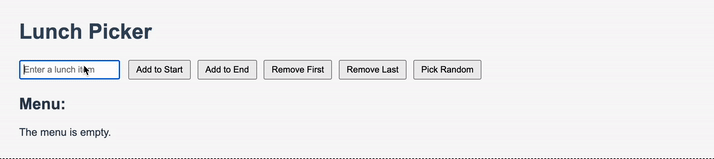

# Lunch Picker App

A small interactive JavaScript application that helps users manage and pick lunch options.

## Features
- Add lunch items to the start or end of the menu
- Remove items from start or end
- Pick a random lunch
- Shows the current menu dynamically
- Automatically formats new entries so the first letter is capitalized (e.g., "pizza" → "Pizza")

## Technologies
- JavaScript (Arrays, Functions)
- HTML (DOM Manipulation)
- CSS for layout and styling

## What I learned
- Guard clauses for edge cases
- Array methods: push, pop, shift, unshift
- Random selection
- DOM event handling
- Clean function structure
- Utility functions for text formatting (capitalize user input)

## Demo
Here is a short Demo-GIF:

---

# Lunch Picker App (Deutsch)

Eine kleine interaktive JavaScript-Anwendung, die beim Verwalten und Auswählen von Mittagessen hilft.

## Features
- Gerichte am Anfang oder Ende des Menüs hinzufügen
- Gerichte am Anfang oder Ende entfernen
- Zufällige Auswahl eines Gerichts
- Aktuelles Menü dynamisch anzeigen
- Neue Einträge werden automatisch formatiert: Erstes Zeichen groß, Rest klein (z. B. "pizza" → "Pizza")

## Technologien
- JavaScript (Arrays, Funktionen)
- HTML (DOM-Manipulation)
- CSS für Layout und Styling

## Was ich gelernt habe
- Guard Clauses für Edge Cases
- Array-Methoden: push, pop, shift, unshift
- Zufällige Auswahl
- DOM Event Handling
- Saubere Struktur von Funktionen
- Utility-Funktionen zur Textformatierung (capitalize für Benutzereingaben)

## Demo
Hier ist ein kurzes Demo-Gif:
